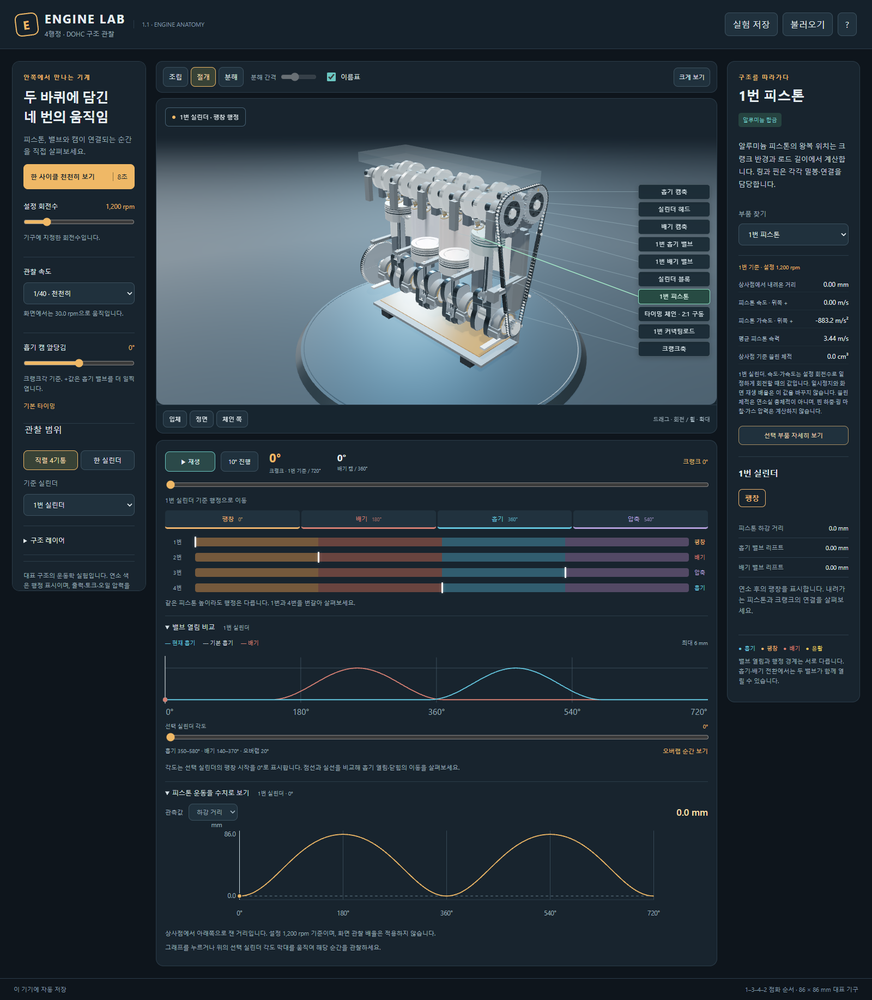

# Engine Lab

**Engine Lab**은 DOHC 4행정 엔진의 구조와 움직임을 관찰하는 앱입니다. 피스톤·커넥팅 로드·크랭크축·캠축·밸브를 움직여 보고, 같은 피스톤 위치에서 행정이 달라지는 이유를 살펴봅니다.

이 브랜치는 **1.1.0 개선 작업본**입니다. 현재 공개된 설치판은 **1.0.0**이며, 1.1.0 설치파일은 아직 공개하지 않았습니다. 공개 설치파일과 버전별 변경·검증 환경·결과는 [GitHub Releases](https://github.com/Ulsancl/engine-lab/releases/latest)에서 확인하세요. 검증 결과는 해당 환경의 관찰 기록이며 다른 환경의 성능을 보장하지 않습니다.

## 1.1.0에서 개선한 관찰

- 피스톤의 실제 링 홈, 크라운 아래 공간, 열린 스커트와 핀 보스, 로드의 단면과 분할 캡을 더 자세히 표현합니다. 기존 핀 좌표와 86 mm 행정·143 mm 로드 중심 거리를 유지합니다.
- 선택한 부품의 현재 속도·가속도·밸브 열림 시간·행정 체적을 읽습니다. **피스톤 운동을 수치로 보기**에서 하강 거리·속도·가속도 곡선을 바꾸고, 그래프를 눌러 선택 실린더의 해당 각도로 이동할 수 있습니다.
- **선택 부품 자세히 보기**로 부품을 따로 확대합니다. 움직이는 부품은 화면이 따라가며, **전체 구조**로 돌아가면 확대 전 시점과 현재 표시 설정을 복원합니다. 확대 중 저장해도 원래 전체 관찰 시점이 파일에 들어갑니다.




## 처음 살펴보기

1. **한 사이클 천천히 보기**를 누릅니다. 크랭크 두 바퀴와 캠 한 바퀴를 따라 네 행정이 이어지는 모습을 봅니다.
2. **일시정지** 후 각도 막대나 **10° 진행**으로 밸브가 열리는 순간을 찾습니다. **한 실린더**로 바꾸고 1번과 4번을 비교하면 같은 피스톤 높이에서도 행정이 다름을 볼 수 있습니다.
3. **부품 찾기**에서 피스톤 링·베어링·캠축을 선택하고 설명을 읽습니다. **절개**로 안쪽을, **분해**로 부품의 연결을 살펴봅니다. 드래그로 회전하고 휠로 확대합니다. 1.1.0 작업본에서는 **선택 부품 자세히 보기**와 부품별 계산값도 사용할 수 있습니다.
4. **흡기 캠 앞당김**을 바꾸고 밸브 타이밍 곡선을 읽습니다. 기본 흡기는 점선, 현재 흡기와 배기는 각각의 곡선으로 표시됩니다. 선택한 실린더의 각도 표시와 **오버랩 순간 보기**로 두 밸브가 함께 열리는 구간을 확인합니다.
5. 남겨 둘 관찰은 **실험 저장**으로 파일에 보관합니다. **불러오기**로 설정·각도·표시 방식·시점을 함께 복원합니다.

**설정 회전수**는 기구에 지정한 회전 속도이고 **관찰 속도**는 화면에서 느리게 보는 배율입니다. 한 사이클 안내는 약 8초 동안 관찰하도록 배율을 맞춥니다. 창이 가려지면 관찰을 멈추며, 다시 시작할 때는 재생 버튼을 누릅니다.

1.1.0의 속도·가속도와 열림 시간은 **설정 회전수 기준**입니다. 일시정지하거나 관찰 배율을 바꿔도 그 각도에서의 운동값을 읽습니다. 피스톤 속도·가속도는 위쪽이 양수이고, 밸브 속도는 열림이 양수입니다. 밸브의 열림·닫힘 끝점에서는 가속도가 불연속이므로 숫자 대신 이를 알리는 문구가 나옵니다.

**새 실험**을 누른 직후에는 화면 아래 **새 실험 이전으로 되돌리기**로 직전 관찰을 복구할 수 있습니다. 이 되돌리기는 현재 실행 중인 앱에서만 유지되므로, 나중에도 보관할 관찰은 파일로 저장하세요.

## 다루는 범위

기하학적 운동과 부품 간 연결을 관찰합니다. 회전수와 관찰 시점을 바꿔 운동을 살펴보며, 행정 표시는 설명용입니다. 실제 연소·출력·토크·열·마찰·윤활 유동을 계산하거나 실차 엔진의 상태를 진단하는 도구는 아닙니다. 제조사의 CAD·사진을 배포하지 않고 앱에서 만든 형상을 사용합니다.

부품의 가속도를 하중·강도 계산으로 해석하지 않습니다. 배기량은 보어와 행정에서 구한 약 1.998 L이며, 상사점 기준 쓸린 체적은 연소실의 총체적이나 압축비가 아닙니다. 자세한 내용은 [구조 표현](docs/anatomy.md), [계산 모형](docs/model.md), [상세 관찰 개선 기록](docs/detail-refinement.md)을 참고하세요.

## Windows 설치와 실행

현재 공개판을 설치하려면 제공받은 `Engine-Lab-Setup-1.0.0.exe`를 실행하고 설치 위치를 선택합니다. 설치 후 바탕화면이나 시작 메뉴의 **Engine Lab** 아이콘으로 실행하세요. 앱에는 운동 모형과 3D 화면이 포함되어 있으며 **Node.js·별도 서버·인터넷 연결 없이** 사용할 수 있습니다. 이 배포 설정에는 코드 서명이 없으므로 Windows가 알 수 없는 게시자 또는 평판 경고를 표시할 수 있습니다. 제공처와 함께 제공된 SHA-256을 확인하고 실행하세요. 자동 업데이트 기능은 없습니다.

이전 버전을 사용했다면 먼저 **실험 저장**으로 관찰 파일을 보관하고 앱을 닫은 뒤 새 설치파일을 실행합니다. 같은 사용자 계정의 앱 저장 폴더를 유지하도록 구성했습니다. 업데이트 후 저장한 관찰을 확인하고, 따로 보관한 파일은 **불러오기**로 다시 열 수 있습니다.

창이 화면 밖으로 벗어난 채 저장돼도 다음 실행 때 현재 모니터 안으로 복원합니다. 도움말은 **?** 또는 **F1**, 앱 제거는 **Windows 설정 → 앱 → 설치된 앱 → Engine Lab**에서 찾을 수 있습니다.

## 관찰을 보관하고 다시 열기

마지막 관찰은 이 기기의 `%APPDATA%\Engine Lab`에 자동 저장됩니다. 앱을 다시 실행하면 일시정지 상태로 돌아옵니다. 다른 PC로 옮기거나 여러 조건을 따로 남기려면 **실험 저장**으로 `.engine.json` 파일을 보관하세요. 파일에는 설정 회전수·캠 위상·크랭크 각도·관찰 배율·부품 표시·시점이 들어갑니다.

1.1.0 작업본은 기존 저장 형식과 운동 모형 식별자 `engine-kinematics-1`을 유지합니다. 1.0.0의 관찰 파일을 그대로 불러오며, 새 상세값은 저장된 조건·각도로 다시 계산합니다. 부품 확대는 임시 관찰 상태라 파일에 저장하지 않습니다. 확대 중 파일을 저장하거나 새 실험 이전 관찰을 보관할 때도 확대 전 시점을 유지합니다.

**불러오기**에서 취소하거나 지원하지 않는 파일을 선택하면 현재 관찰을 유지합니다. 10 MiB 이하의 JSON을 지원하며 Windows 편집기가 붙인 UTF-8 BOM도 읽습니다. 더 새로운 형식은 기존 기록을 보호하기 위해 이 버전에서 열지 않습니다.

자동 저장 원문을 읽지 못했다는 안내가 나오면 **원문 파일 보관**으로 먼저 보관할 수 있습니다. 새 버전의 자동 저장을 발견하면 기존 원문을 덮어쓰지 않습니다. 자동 저장을 완료하지 못했다는 안내가 보이면 앱을 닫기 전에 현재 관찰을 별도 파일로 저장하세요.

기본 저장 폴더는 **도움말 → 저장 폴더 열기**로 확인합니다. 일반적인 앱 제거 시 이 폴더는 유지합니다.

## 개발 환경

**Node.js 24.19.0 이상**과 프로젝트 의존성을 준비한 개발 환경에서 다음 명령을 사용합니다.

```text
npm ci
npm test
npm run build
npm run test:detail
npm run desktop
npm run package:desktop
```

이 브랜치의 설치파일 생성 명령은 Windows x64용 `release/windows/Engine-Lab-Setup-1.1.0.exe`와 SHA-256 확인 파일을 로컬에 만듭니다. 생성만으로 GitHub에 공개되지 않습니다. 공개 전에는 실제 설치·실행·업데이트·파일 보존과 일반 사용자 관찰 흐름의 품질을 평가합니다.

앱은 `app://engine/` 주소를 사용합니다. 파일 읽기는 원본을 바꾸지 않으며 저장은 완성된 임시 파일을 같은 폴더의 목적 파일로 교체합니다.

실제 실행 검사는 `ENGINE_LAB_DATA_DIR`에 별도 임시 폴더를 지정해 사용자 저장소와 분리합니다. `ENGINE_DESKTOP_EXE`를 지정한 데스크톱 검사는 해당 설치 실행파일을 대상으로 하며 자동 빌드를 생략할 수 있습니다.

## 권리와 외부 구성요소

앱 자체는 **UNLICENSED**이며 모든 권리를 보유합니다. 앱 아이콘과 엔진 형상은 직접 작성한 도형으로 만듭니다. Three.js·Electron과 포함 구성요소의 라이선스는 [외부 소프트웨어 고지](docs/THIRD-PARTY-NOTICES.md)를 참고하세요.

가격·판매 조건·환불·고객 지원 범위는 제품 소유자가 별도로 정하며, 현재 문서는 해당 조건의 확정이나 외부 검증을 뜻하지 않습니다.
