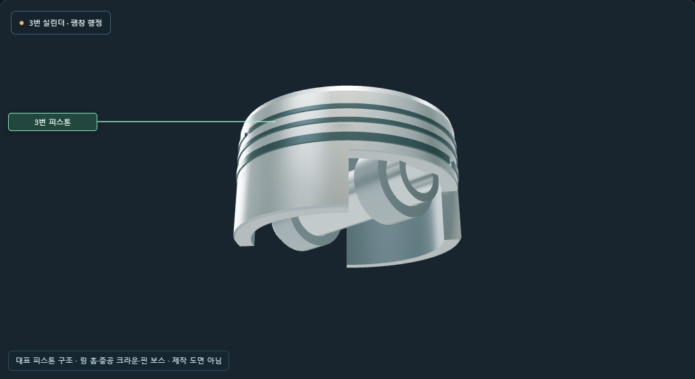

# Engine Lab 구조 표현

Engine Lab은 자체 제작한 대표 DOHC 직렬 4기통 엔진으로, 고정된 기구의 움직임과 4행정의 관계를 관찰하는 프로그램입니다. 제조사의 특정 엔진 도면이나 정비 기준을 복제하지 않았습니다. 단기통 관찰은 같은 직렬 4기통의 선택 실린더를 보여 주므로 전환해도 행정과 위상은 유지됩니다.

이 문서는 1.1.0 개선 작업본의 구조와 관찰 기능을 설명합니다. 현재 공개 설치판은 1.0.0이며, 1.1.0 설치파일의 공개 완료를 뜻하지 않습니다.

피스톤·로드·크랭크는 미터 단위의 동일한 핀 좌표를 사용합니다. 보어 86 mm, 스트로크 86 mm, 로드 길이 143 mm인 대표 치수이며, 크랭크가 두 바퀴 도는 동안 캠축은 한 바퀴 회전합니다. 1-3-4-2 점화 순서를 사용합니다.

## 피스톤·로드의 구조 디테일

피스톤에는 실제로 들어간 세 링 홈과 별도 링 끝 간극이 있습니다. 크라운 아래의 빈 공간, 두 방향으로 열린 스커트, 관통 핀 보스와 크라운을 잇는 리브를 구별할 수 있습니다. 핀은 중공이며 보스와 로드 작은 끝을 통과합니다. 핀에서 크라운까지의 최고 높이 26 mm와 기존 운동 좌표는 유지합니다. 링의 간극과 형상은 관찰용 대표 치수로, 실제 엔진의 조립 공차·열팽창·밀봉 성능을 해석하지 않습니다.

로드는 웹과 양쪽 플랜지를 가진 단면, 분할된 큰 끝 캡, 베어링 셸, 작은 끝 부시와 캡 볼트를 표현합니다. 크랭크 웹에는 모서리와 균형추 형태를 더했습니다. 기구의 연결을 자세히 보여 주는 형상이며 질량·균형·응력·피로 수명을 계산하는 설계는 아닙니다. 선삭·주조 표면의 미세 무늬도 재질을 읽기 위한 시각 표현입니다.

## 밸브·캠·지지 구조

각 실린더에는 흡기 두 개와 배기 두 개의 밸브가 있으며, 공통 흡기·배기 캠축이 하나씩 있습니다. 밸브축은 20° 기울어져 있고 평면 팔로워가 캠 외곽과 접촉합니다. 리프트 6 mm, 기본 원 반지름 30 mm, 열림 기간 230° 크랭크각의 대표 운동을 사용합니다. 캠의 외곽은 같은 리프트 함수의 지지함수 포락선으로 생성하므로 별개의 장식용 타원이 아닙니다. 흡기 타이밍 조절은 로브 형상을 바꾸지 않고 캠축의 각도를 이동합니다.

이 운동학 모형은 연소 압력, 밸브 튕김, 스프링 하중, 유막 두께나 엔진 출력을 계산하지 않습니다. 사인 제곱 리프트의 시작과 끝에서 가속도 연속성을 보장하는 생산용 캠 설계도 아닙니다. 체인 링크와 가이드 형상은 대표 연결을 표시하며 체인 장력·치합 동역학을 해석하지 않습니다.

절개는 관찰면의 벽을 제거하고 실제 두께와 절단면을 남깁니다. 분해 간격은 구조를 구별하기 위한 표시 위치이며, 캠 접촉과 조립 위치는 조립·절개 모드에서 확인합니다. 부품 선택은 시점을 바꾸지 않으며 이름표는 화면에서 수평을 유지합니다.

크랭크 메인 베어링은 위·아래 반쪽으로 축을 감싸고, 위쪽 지지부는 블록, 아래 캡은 고정 볼트에 연결됩니다. 1.1.0의 아래 캡에는 축이 지나는 둥근 안장 형상과 양쪽 볼트 지지부를 표현합니다. 캠축 베어링에도 헤드로 이어지는 받침이 있습니다. 절개에서는 관찰하는 쪽의 블록 지지 벽을 제거하므로 하중을 받는 몸체의 일부가 생략되어 보입니다.

## 현재 위치에서의 운동값

부품별 상세값은 기존 위치식의 미분으로 구합니다. 피스톤의 순간 속도·가속도, 로드 각속도·각가속도, 밸브 리프트·속도·가속도와 열림 시간을 읽을 수 있습니다. **피스톤 운동을 수치로 보기**는 선택 실린더의 0–720° 위상에 따른 하강 거리·속도·가속도 곡선입니다. 그래프를 누르거나 선택 실린더 각도 막대를 움직이면 해당 순간으로 이동합니다. 전역 크랭크각과 선택 실린더 기준각의 차이는 유지합니다.

숫자는 설정 rpm으로 일정하게 회전할 때의 값입니다. 화면 배율을 낮추거나 일시정지해도 운동값은 그대로이며, rpm을 두 배로 하면 속도는 두 배, 가속도는 네 배가 됩니다. 피스톤은 위쪽을 양수로, 밸브는 열림을 양수로 표시합니다. 밸브 리프트는 속도까지 연속이지만 열림·닫힘 경계에서 가속도가 불연속이어서 그 순간에는 ‘끝점에서 불연속’을 표시합니다.

보어와 행정에서 구한 실린더당 행정 체적은 약 499.557 cm³, 4기통 총 배기량은 약 1.998229 L입니다. 상사점에서 추가로 쓸린 체적에는 연소실의 틈새 체적이 들어 있지 않습니다. 이를 총체적·압축비·가스 유량으로 읽지 않습니다. 식과 단위는 [계산 모형](model.md)에 정리했습니다.

## 선택 부품 확대와 저장

**선택 부품 자세히 보기**는 해당 부품과 그 안에 연결된 형상을 따로 보여 줍니다. 작은 부품에는 추가 확대를 적용하고, 움직이는 부품의 위치를 화면이 따라갑니다. 꺼 둔 레이어의 부품도 명시적으로 확대하면 일시적으로 드러낼 수 있습니다. 이때 레이어 선택 자체는 바꾸지 않습니다. 다른 부품을 선택하는 동작과 새 부품을 확대하는 동작은 구분됩니다.

**전체 구조**로 돌아가면 확대 전 카메라 위치·바라보는 곳·확대율과 현재 표시 설정을 복원합니다. 확대 중 저장해도 파일에는 확대 전 시점을 보관합니다. 파일을 불러올 때 임시 부품 확대는 해제합니다. 기존 1.0.0의 저장 형식과 운동 모형 식별자를 유지하므로 저장된 조건·각도·시점을 읽고 새 상세값을 계산할 수 있습니다.

## 윤활 경로와 안내 표시

오일 표시를 켜면 흡입망, 크랭크축과 같은 축의 직접 구동형 펌프, 필터, 메인 갤러리, 크랭크·캠 베어링의 대표 공급 연결이 나타납니다. 크랭크 내부의 통로는 함께 회전하며 로드 큰 끝으로 이어집니다. 금색 선은 내부 통로를 투시해 강조한 표시로, 엔진 바깥에 달린 배관이 아닙니다. 단기통에서는 선택 실린더와 인접한 두 메인 베어링의 공급 가지를 표시합니다.

밝은 점은 흐름 방향을 안내합니다. 유량·유압·온도의 측정값이 아니며 실제 엔진별 오일 통로, 펌프 로터의 상세 치합, 중력에 의한 회수 유동까지 재현하지 않습니다. 행정별 색과 점화 불빛도 연소 계산 결과가 아닌 위치·순서 안내입니다.
